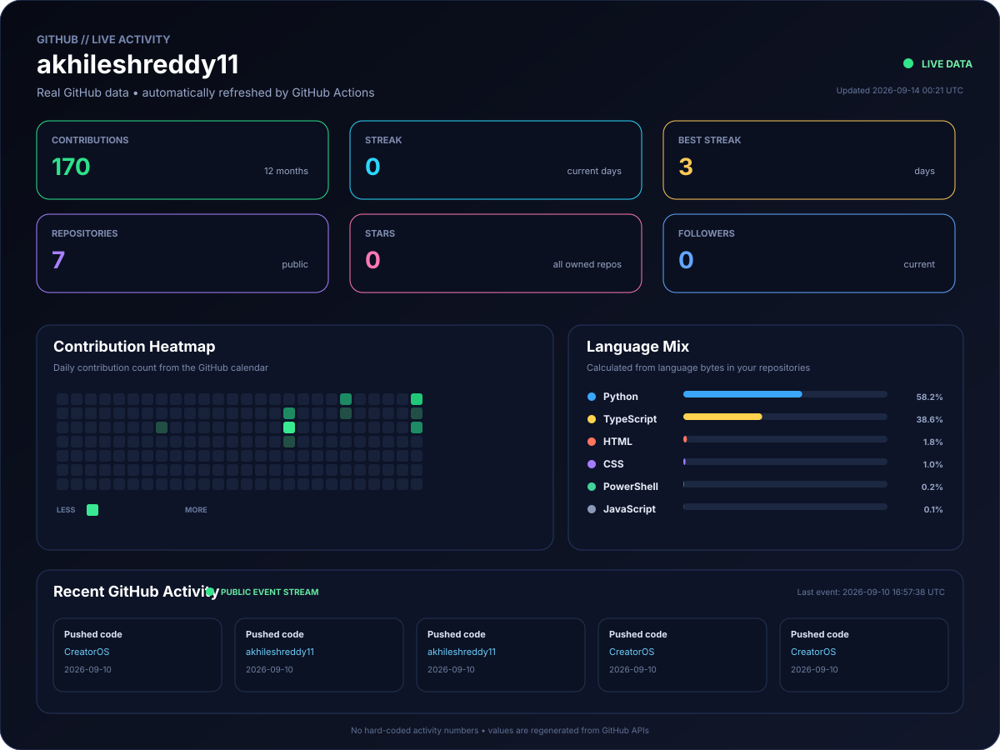

<!--
╔══════════════════════════════════════════════════════════════════════╗
║  AKHILESH REDDY THIRUMALA REDDY                                    ║
║  AI / ML • COMPUTER VISION • AGENTIC AI • AUTOMATION                ║
╚══════════════════════════════════════════════════════════════════════╝
-->

  

  
  
  
  

  

---

# 👋 Hi, I'm Akhilesh

I'm a **B.Tech CSE (AI & ML) student at Mahatma Gandhi Institute of Technology (MGIT)** focused on building practical AI systems.

My work sits at the intersection of:

**Machine Learning · Deep Learning · Computer Vision · Generative AI · Agentic AI · Automation · Backend Engineering**

I enjoy taking an idea from **problem → architecture → model → API → product**.

> **Build systems. Learn deeply. Ship useful things.**

---

## 🧭 What I'm Working Toward

<table>
<tr>
<td width="25%" align="center">
<h3>🤖 AI Engineering</h3>

Building intelligent systems that connect models with real applications.

</td>
<td width="25%" align="center">
<h3>🧠 Agentic AI</h3>

Exploring agents, memory, reasoning, tool use and multi-agent workflows.

</td>
<td width="25%" align="center">
<h3>👁️ Computer Vision</h3>

Developing image-based systems for recognition, classification and detection.

</td>
<td width="25%" align="center">
<h3>⚙️ Automation</h3>

Turning repetitive workflows into intelligent, automated processes.

</td>
</tr>
</table>

---

# 🚀 Featured Projects

## ⚡ CreatorOS

  

**CreatorOS** is an AI-powered creator operating system designed around **AI employees, missions, workflows and intelligent automation**.

**Focus:** AI Employees · Mission Execution · Content Workflows · Product Workflows · Automation

  

---

## 🧠 OmniMind

  

A platform being developed around **intelligent agents, memory, reasoning, automation and real-world AI workflows**.

**Direction:** Multi-Agent Systems · Memory · Reasoning · AI Workflows

  

---

## 🔍 FindBuddy

  

An **AI-powered missing person identification system** exploring computer vision and face-recognition techniques for matching a known person image against captured images/video.

**Stack:** Python · Flask · OpenCV · TensorFlow · DeepFace · PostgreSQL

  

---

## 🌱 Crop Disease Detection

  

A deep-learning application for identifying **plant diseases from leaf images** using image preprocessing and CNN-based classification.

**Stack:** Python · TensorFlow · Keras · OpenCV · CNN

  

---

## 📄 AI Code Documentation Generator

  

An AI-assisted developer tool that **analyzes source code and generates structured documentation**, combining NLP, code processing and a web interface.

**Stack:** Python · Flask · NLP · HTML · CSS · JavaScript

  

---

# 🛠️ Technology Stack

### 🤖 AI / ML

### 🌐 Development

### 🗄️ Data / Backend / Tools

---

# 🧩 Engineering Focus

<table>
<tr>
<td width="50%" valign="top">

### 01 — Intelligent Systems
- Machine learning pipelines
- Deep-learning models
- Computer-vision applications
- Model evaluation and preprocessing
- AI-backed APIs

</td>
<td width="50%" valign="top">

### 02 — AI Products
- Agentic workflows
- Multi-agent architecture
- Automation
- Developer tools
- AI-first product experiences

</td>
</tr>
</table>

<b>Problem → Data → Model → API → Product → Feedback → Improvement</b>

---

# 📜 Certifications & Programs

<table>
<tr>
<td width="50%" valign="top">

### 🤖 IBM
**AI Fundamentals**  
<a href="https://github.com/akhileshreddy11/Certifications/blob/main/IBM%20AI/IBM%20AI.pdf">View Certificate →</a>

### 🌐 Cisco
**AI Fundamentals**  
<a href="https://github.com/akhileshreddy11/Certifications/blob/main/Cisco/ai%20fundamentals.pdf">View Certificate →</a>

### 📄 Cisco
**Apply AI: Update Your Resume**  
<a href="https://github.com/akhileshreddy11/Certifications/blob/main/Cisco/Ai_Application.pdf">View Certificate →</a>

### ⭐ Cisco
**Apply AI: Analyze Customer Reviews**  
<a href="https://github.com/akhileshreddy11/Certifications/blob/main/Cisco/Customer_reviews_AI.pdf">View Certificate →</a>

### 🔐 Cisco
**Introduction to Cybersecurity**  
<a href="https://github.com/akhileshreddy11/Certifications/blob/main/Cisco/CISCO%20CYBER%20SECURITY.pdf">View Certificate →</a>

</td>
<td width="50%" valign="top">

### 🇮🇳 INDIAai
**Yuva AI for All**  
<a href="https://github.com/akhileshreddy11/Certifications/blob/main/IndiaAI/Akhilesh_reddy_402293.pdf">View Certificate →</a>

### 💼 ServiceNow
**Virtual Internship Program**  
<a href="https://github.com/akhileshreddy11/Certifications/blob/main/ServiceNow/ServiceNow_certificate.pdf">View Certificate →</a>

### 🚀 iStudio
**Artificial Intelligence Internship**  
<a href="https://github.com/akhileshreddy11/Certifications/blob/main/iStudio/istudio_internship.pdf">View Certificate →</a>

### 🎓 iStudio
**Artificial Intelligence Training**  
<a href="https://github.com/akhileshreddy11/Certifications/blob/main/iStudio/istudio_Training.pdf">View Certificate →</a>

### 🏆 Cognizant
**Technoverse Hackathon 2026 — Participation**  
<a href="https://github.com/akhileshreddy11/Certifications/blob/main/cognizant/cognizant_participation.pdf">View Certificate →</a>

</td>
</tr>
</table>

  

---

# 📊 GitHub — Live Activity

  

  Dashboard generated from GitHub activity and refreshed automatically through GitHub Actions.

---

# 🐍 Contribution Activity

  

---

# 📈 My Development Loop

  
  
  
  
  
  

> I don't want AI to remain a demo.  
> I want to understand the system behind it, build the software around it, and turn it into something people can actually use.

---

# 🔭 Currently Building

| Project | Direction |
|---|---|
| ⚡ **CreatorOS** | AI employees, missions, content workflows, product workflows and automation |
| 🧠 **OmniMind** | Agents, memory, reasoning and intelligent AI workflows |
| 👁️ **Computer Vision Systems** | Recognition, classification and image-based AI applications |
| ⚙️ **AI Engineering** | Agentic AI, RAG, automation and production-oriented AI development |

---

# 🎓 Education

**Mahatma Gandhi Institute of Technology (MGIT)**  
**B.Tech — Computer Science & Engineering (Artificial Intelligence & Machine Learning)**  
Expected Graduation: **2027**

---

# 🌍 Let's Connect

  
  
  
  

  

  <b>AI / ML • Computer Vision • Agentic AI • Automation</b>
   
  Building from ideas to intelligent products.

