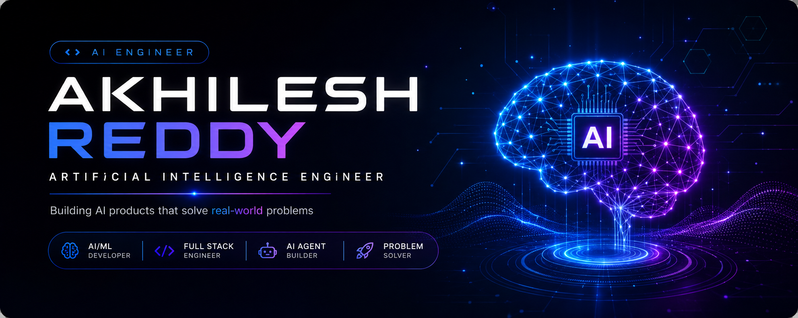
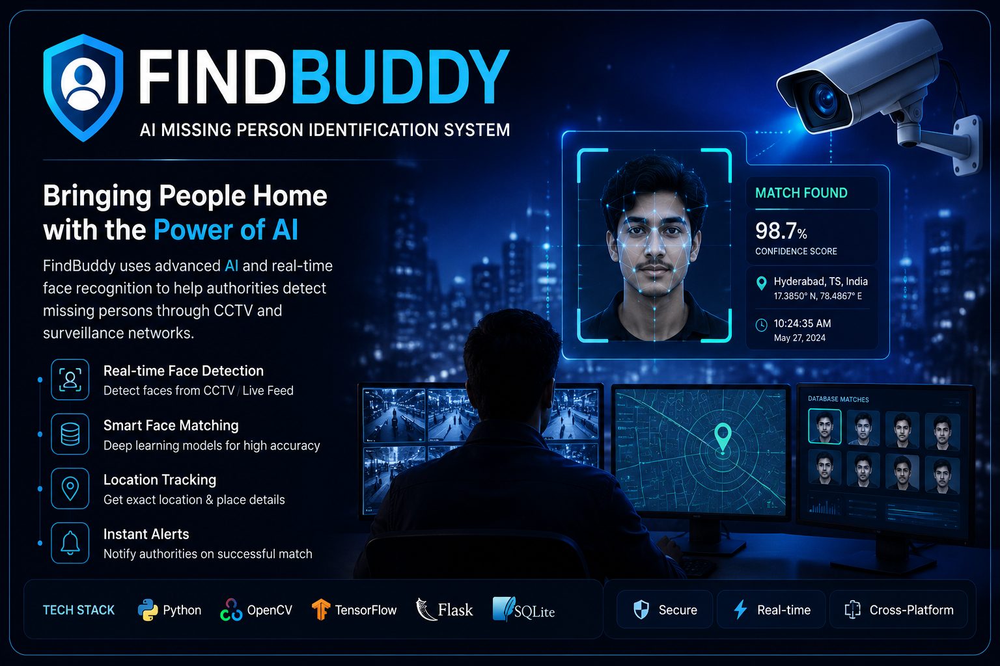
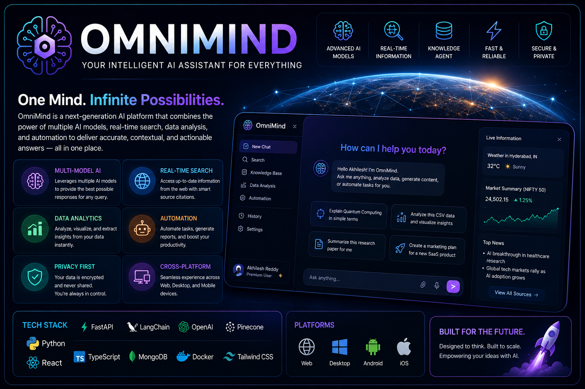
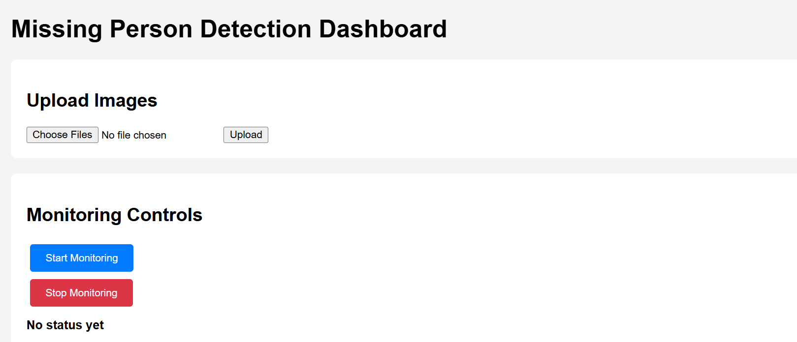
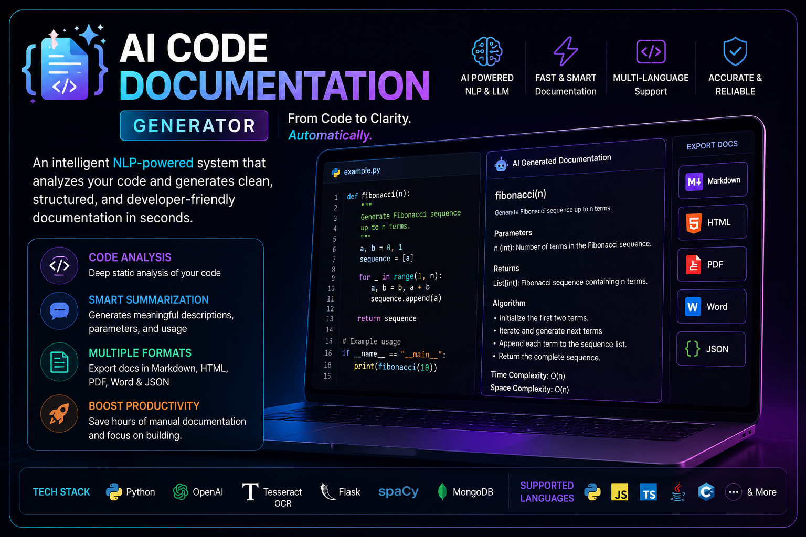

<!-- ====================================================== -->
<!--                  PREMIUM HERO SECTION                   -->
<!-- ====================================================== -->

 

<h1 align="center">
👋 Hi, I'm Akhilesh Reddy Thirumala Reddy
</h1>

<h3 align="center">
Artificial Intelligence & Machine Learning Engineer
</h3>

Building intelligent AI products that solve real-world problems through
<b>Machine Learning</b>,
<b>Computer Vision</b>,
<b>Generative AI</b>, and
<b>Agentic AI</b>.

 

---

## 🧠 AI Snapshot

| | |
|:---|:---|
| 🟢 **Status** | Open to AI Internships |
| 🤖 **Current Build** | OmniMind |
| 🔍 **Flagship Project** | FindBuddy |
| 🧠 **Currently Learning** | Agentic AI • RAG • MLOps |
| 🎓 **Education** | B.Tech CSE (AI & ML), MGIT |
| 📍 **Location** | Hyderabad, India |

---

<!-- ====================================================== -->
<!--                 FEATURED PROJECTS                      -->
<!-- ====================================================== -->

<!-- ====================================================== -->
<!--                  FEATURED PROJECTS                      -->
<!-- ====================================================== -->

<h1 align="center">🚀 Featured AI Projects</h1>

A collection of AI-powered applications focused on solving real-world problems through Artificial Intelligence, Computer Vision, and Natural Language Processing.

 

<table>

<tr>

<td width="50%" valign="top">

<h2 align="center">🔍 FindBuddy</h2>

<b>AI-Powered Missing Person Identification System</b> 
Uses computer vision and face recognition techniques to assist in identifying missing individuals.

Python • Flask • OpenCV • TensorFlow • PostgreSQL

</td>

<td width="50%" valign="top">

<h2 align="center">🧠 OmniMind</h2>

<b>Next-Generation Multi-Agent AI Platform</b> 
A flagship AI platform currently under development, designed around intelligent agents, memory, reasoning, automation, and real-world AI workflows.

Planned Tech Stack: 
Python • FastAPI • LangChain • Vector Database

</td>

</tr>

<tr>

<td width="50%" valign="top">

<h2 align="center">🌱 Crop Disease AI</h2>

<b>AI-Powered Crop Disease Detection System</b> 
Deep learning application that identifies plant diseases from leaf images and predicts the disease class to support precision agriculture.

Python • TensorFlow • Flask • OpenCV • CNN

</td>

<td width="50%" valign="top">

<h2 align="center">📄 AI Code Documentation Generator</h2>

<b>AI-Powered Code Documentation Generator</b> 
Automatically analyzes source code and generates structured, developer-friendly documentation with grammar refinement and export support.

Python • Flask • NLP • HTML • CSS • JavaScript

</td>

</tr>

</table>

---
<!-- ====================================================== -->
<!--                  TECHNOLOGY STACK                       -->
<!-- ====================================================== -->

<h1 align="center">⚡ Technology Stack</h1>

Technologies I use to build intelligent, scalable and production-ready AI applications.

 

<h3 align="center">🤖 Artificial Intelligence & Machine Learning</h3>

Machine Learning • Deep Learning • Computer Vision • CNN • Image Processing

 

<h3 align="center">💻 Programming Languages</h3>

 

<h3 align="center">🌐 Web Development</h3>

 

<h3 align="center">🗄️ Databases</h3>

 

<h3 align="center">⚙️ Tools & Platforms</h3>

 

<h3 align="center">📚 Currently Learning</h3>

---
<!-- ====================================================== -->

<!--                PROFESSIONAL CERTIFICATIONS             -->

<!-- ====================================================== -->

<h1 align="center">📜 Professional Certifications</h1>

Industry-recognized certifications demonstrating continuous learning in Artificial Intelligence, Machine Learning, Cybersecurity, Enterprise Technologies, and Professional Development.

 

Provider

Certification

Credential

<!-- ====================================================== -->
<!--                  GITHUB DASHBOARD                      -->
<!-- ====================================================== -->

<h1 align="center">📊 GitHub Dashboard</h1>

A snapshot of my development activity and contributions.

 

---

<!-- ====================================================== -->
<!--              ACHIEVEMENTS & LEARNING                   -->
<!-- ====================================================== -->

<h1 align="center">🏆 Achievements & Learning Journey</h1>

Continuously improving through hands-on AI projects, research, and practical software development.

 

<table>

<tr>

<td width="50%" valign="top">

<h3>🎓 Education</h3>

• B.Tech – Computer Science (AI & ML) 
• Mahatma Gandhi Institute of Technology (MGIT) 
• Hyderabad, India

</td>

<td width="50%" valign="top">

<h3>🚀 Current Focus</h3>

• Building OmniMind 
• Improving FindBuddy 
• Learning Agentic AI 
• Exploring RAG & MLOps

</td>

</tr>

<tr>

<td width="50%" valign="top">

<h3>💡 Areas of Interest</h3>

• Artificial Intelligence 
• Machine Learning 
• Computer Vision 
• Generative AI 
• Full Stack AI Applications

</td>

<td width="50%" valign="top">

<h3>🎯 Career Goal</h3>

Become an AI Engineer building intelligent products that solve real-world problems and positively impact society.

</td>

</tr>

</table>

---

<!-- ====================================================== -->
<!--                    CONNECT                             -->
<!-- ====================================================== -->

<h1 align="center">🌍 Connect With Me</h1>

---

## ⭐ Thanks for visiting!

  

*"Building AI solutions that create real-world impact."*

  

Made with ❤️ by **Akhilesh Reddy Thirumala Reddy**

