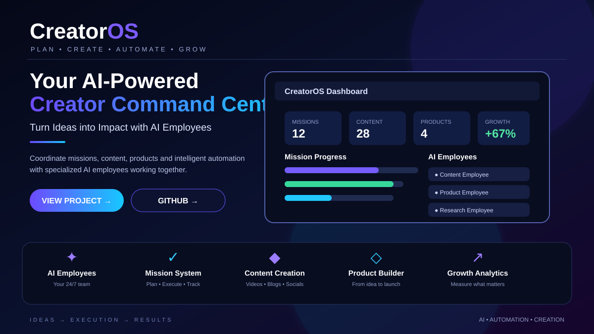

<!-- ====================================================== -->
<!--                  PREMIUM AI PROFILE                     -->
<!-- ====================================================== -->

  

 

<h1 align="center">👋 Hi, I'm Akhilesh Reddy Thirumala Reddy</h1>
<h3 align="center">Artificial Intelligence & Machine Learning Engineer</h3>

Building intelligent products that solve real-world problems through <b>Machine Learning</b>, <b>Computer Vision</b>, <b>Generative AI</b>, and <b>Agentic AI</b>.

 

  
  
  
  

---

## 🧠 AI Snapshot

| | |
|:---|:---|
| 🟢 **Status** | Open to AI Internships |
| 🚀 **Flagship Build** | CreatorOS |
| 🤖 **AI Platform** | OmniMind |
| 🔍 **Computer Vision** | FindBuddy |
| 🧠 **Learning** | Agentic AI • RAG • MLOps |
| 🎓 **Education** | B.Tech CSE (AI & ML), MGIT |
| 📍 **Location** | Hyderabad, India |

---

## 🚀 Featured AI Projects

Selected projects demonstrating practical AI engineering across intelligent agents, computer vision, deep learning, and developer tooling.

<table>
<tr>
<td width="50%" valign="top">
<h2 align="center">⚡ CreatorOS</h2>

<b>AI-Powered Creator Operating System</b> Coordinates AI employees, missions, content workflows, product workflows, and intelligent automation.

<b>AI Agents • Automation • Mission System • Content • Products</b>

</td>
<td width="50%" valign="top">
<h2 align="center">🧠 OmniMind</h2>

<b>Multi-Agent AI Platform</b>

A flagship platform being developed around intelligent agents, memory, reasoning, automation, and real-world AI workflows.

<b>Python • FastAPI • LangChain • Vector Database</b>

</td>
</tr>
<tr>
<td width="50%" valign="top">
<h2 align="center">🔍 FindBuddy</h2>

<b>AI-Powered Missing Person Identification System</b> Uses computer vision and face-recognition techniques to assist with identifying missing individuals.

<b>Python • Flask • OpenCV • TensorFlow • PostgreSQL</b>

</td>
<td width="50%" valign="top">
<h2 align="center">🌱 Crop Disease AI</h2>

<b>AI-Powered Crop Disease Detection System</b> Deep-learning application that identifies plant diseases from leaf images and predicts the disease class.

<b>Python • TensorFlow • Flask • OpenCV • CNN</b>

</td>
</tr>
<tr>
<td width="50%" valign="top">
<h2 align="center">📄 AI Code Documentation Generator</h2>

<b>AI-Powered Developer Documentation Assistant</b> Analyzes source code and generates structured developer-friendly documentation with grammar refinement and export support.

<b>Python • Flask • NLP • HTML • CSS • JavaScript</b>

</td>
<td width="50%" valign="top">
<h2 align="center">🎯 AI Engineering Philosophy</h2>

I focus on turning AI concepts into usable products rather than isolated experiments.

<b>Agents • Vision • Automation • Developer Tools • Real-World AI</b>

</td>
</tr>
</table>

---

## ⚡ Technology Stack

Technologies I use to build intelligent, scalable applications.

<h3 align="center">🤖 AI & Machine Learning</h3>

Machine Learning • Deep Learning • Computer Vision • CNN • NLP • Generative AI

<h3 align="center">🌐 Development</h3>

<h3 align="center">🗄️ Data & Infrastructure</h3>

<h3 align="center">🧠 AI Engineering Focus</h3>

    

---

## 🏆 Professional Certifications

Certifications, internships, training programs, and hackathon participation across AI, cybersecurity, enterprise technologies, and software development.

<table>
<tr>
<td width="50%" valign="top"><h3 align="center">🤖 IBM — AI Fundamentals</h3>
Artificial Intelligence Fundamentals

</td>
<td width="50%" valign="top"><h3 align="center">🌐 Cisco — AI Fundamentals</h3>
AI Fundamentals with IBM SkillsBuild

</td>
</tr>
<tr>
<td width="50%" valign="top"><h3 align="center">📄 Cisco — Apply AI</h3>
Update Your Resume

</td>
<td width="50%" valign="top"><h3 align="center">⭐ Cisco — Apply AI</h3>
Analyze Customer Reviews

</td>
</tr>
<tr>
<td width="50%" valign="top"><h3 align="center">🔐 Cisco — Cybersecurity</h3>
Introduction to Cybersecurity

</td>
<td width="50%" valign="top"><h3 align="center">🇮🇳 INDIAai — Yuva AI for All</h3>
AI learning initiative

</td>
</tr>
<tr>
<td width="50%" valign="top"><h3 align="center">💼 ServiceNow</h3>
Virtual Internship Program

</td>
<td width="50%" valign="top"><h3 align="center">🚀 iStudio — AI Internship</h3>
Artificial Intelligence Internship

</td>
</tr>
<tr>
<td width="50%" valign="top"><h3 align="center">🎓 iStudio — AI Training</h3>
Artificial Intelligence Training

</td>
<td width="50%" valign="top"><h3 align="center">🏆 Cognizant Technoverse 2026</h3>
Hackathon Participation

</td>
</tr>
</table>

---

## 📊 GitHub Dashboard

Live contribution statistics, streak, language distribution, activity graph, and profile achievements.

### 🐍 Contribution Activity

---

## 🛠️ Currently Building
<table><tr><td width="33%" align="center"><h3>⚡ CreatorOS</h3>AI-powered creator workflows, missions, and intelligent employee orchestration.</td><td width="33%" align="center"><h3>🧠 OmniMind</h3>Multi-agent architecture with memory, reasoning, and automation.</td><td width="33%" align="center"><h3>🔬 AI Engineering</h3>Agentic AI, RAG, MLOps, computer vision, and production AI systems.</td></tr></table>

---

## 🎓 Journey & Direction

| | |
|:---|:---|
| 🎓 **Education** | B.Tech CSE (AI & ML), Mahatma Gandhi Institute of Technology (MGIT) |
| 📍 **Based In** | Hyderabad, India |
| 💡 **Interests** | AI Engineering • Computer Vision • Generative AI • Agentic AI |
| 🎯 **Goal** | Build reliable AI products that solve meaningful real-world problems |
| 🚀 **Approach** | Learn → Build → Test → Deploy → Improve |

---

## 🌍 Let's Connect

   

 

  <b>⭐ Thanks for visiting my profile!</b>  <i>Building AI solutions that move from ideas to real-world impact.</i>  <b>Akhilesh Reddy Thirumala Reddy</b>

